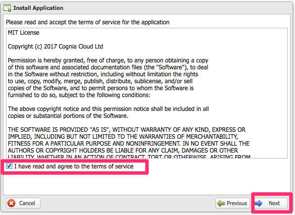

#Cognia Splunk-Collector & Cognia-Reciver App for Splunk

The Cognia-Reciever App for Splunk is a Splunk Application to allow customers to enable remote realtime collection of events from the Cognia Platform.

The application leverages the Cognia Application Framework to subscribe to any available event, and have these events published to a customers Splunk server whether that be pysically installed on customer premise, hosted in colo/CSP or indeed on Splunk Cloud.

In order to easily enable subscription to these events, customers can install the Splunk-Collector app in the Cognia Portal to quickly and simply configure your Cognia account to securley start sending events.
* Customers with in-house development teams or very specific needs may choose to build custom subscription solutions using the full Cognia Application Framework. Details of which can be found at http://developer.cognia.com/v2/index.html

In most cases, sucesseful and simple installation and configuration may require two steps:
* Install the "Cognia-Reciver" application on your Splunk HEC and Search Heads.
* Install the "Splunk-Collector" application in your Cognia Portal Account.

##Install the Cognia-Reciver for Splunk Application
Download the Cognia-Reciver app from Splunkbase:
https://splunkbase.splunk.com/app/3062/

The application includes predefined inputs which will configure a defaut HEC token for use by the app.
Your Splunk Administrator may also choose to record the channel GUID used by the app which is:
`FE0ECFAD-13D5-401B-847D-77833BD77131`

Following installation, the Splunk app provides a number of dashboards, searches and data models to help you interpret the real time events from the Cognia Platform.

##Configure Cognia Portal to Send Events to Splunk

Login to the Cognia console. Choose the Application Store from the menu to see a list of available applications.
* If you do not have access to the Application Store, please contact your Cognia reseller to enable access.

Click on the Splunk Collector Application to install the app.

Review the details of the application, and click next to continue

Review the licence, click to accept and click next.

Enter the address of your Splunk Http Event Collector and specifiy the port number.
If your Splunk adminsitrator has provided you a specific HEC Token you can enter this, otherwise leave this field blank.
If you require a specific sourcetype name you can override the default "cognia:event". Leave this field blank unless you plan to update the Cognia-Reciver Splunk Application.

Choose where in your organisation structure to install the application. In most cases you will wish to do so at the root of your account.
